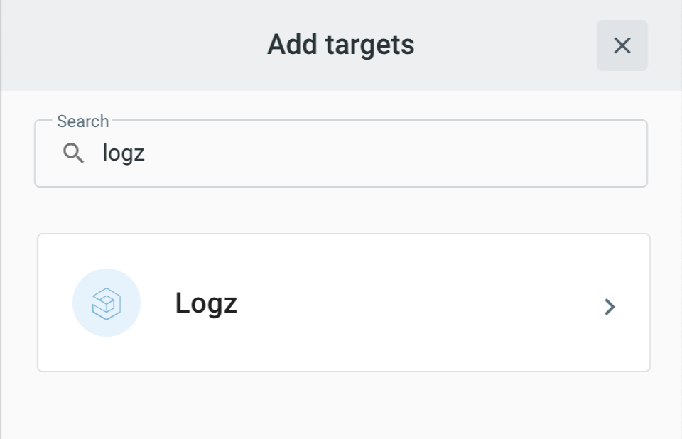
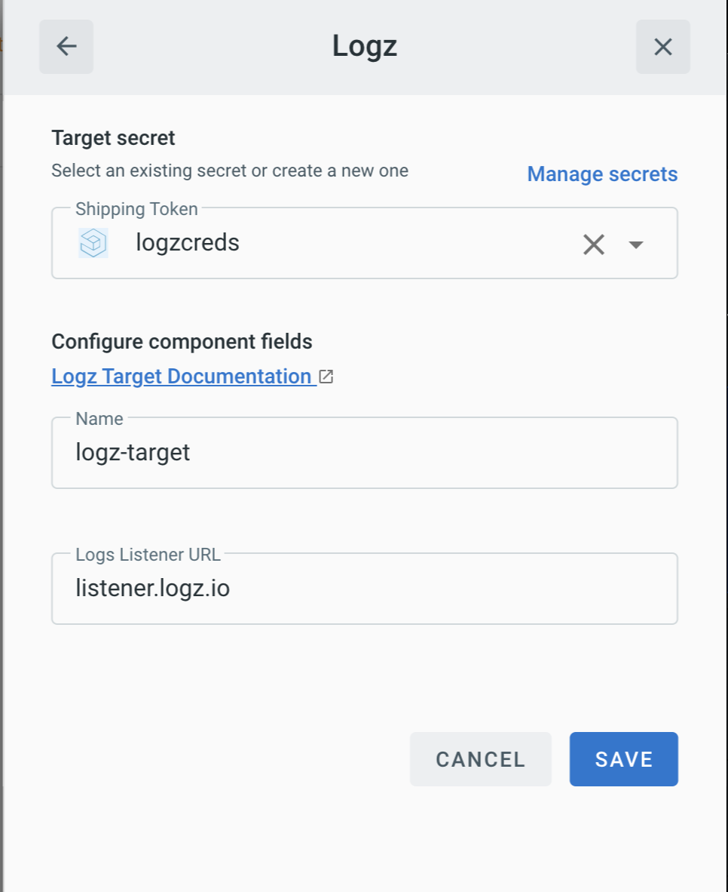

# Event Target for Logz.io 
This event target integrates with Logz.io, using received CloudEvent's to ship messages to [Logz.io](https://logz.io/)

## Prerequisites
* Logz.io account
* Logz.io shipping [token](https://docs.logz.io/user-guide/tokens/)


## Deploying an Instance of the Target
Open the Bridge creation screen and add a Target of type `Logz`.



In the Target creation form, provide a name for the event Target, and add the following information:

* **[Shipping Token](https://docs.logz.io/user-guide/tokens/log-shipping-tokens/)** An API token used for authentication. 
* **Logs Listener URL** An API endpoint that can be found above your shipping token in the Logz.io dashboard.




After clicking the `Save` button, the console will self-navigate to the Bridge editor. Proceed by adding the remaining components to the Bridge.

After submitting the bridge, and allowing some configuration time, a green check mark on the main _Bridges_ page indicates that the bridge with was successfully created.

## Event Types
A Logz event Target accepts the following CloudEvent types:

### Event Type io.triggermesh.logz.ship

The Logz Target can also consume event's of type `io.triggermesh.logz.ship`, and will produced responses typed `io.triggermesh.logz.ship.response`. 

The payload contains a JSON structure with elements to execute the API request:

- `message`: The message to log within Logz.io


## Examples

Create a Logz message:

* event type: `io.triggermesh.logz.ship`
* data:
```json
{
  "message": "hello world"
}
```